# Welcome to the Neuledge documentation!

[Neuledge Engine](https://github.com/neuledge/engine-js) is an powerfull language that simplifies data management and enhances data integrity for databases. It enables you to define your data models and business logic in a precise and customizable way. The schema language supports customizable scalar types, providing type-safe data models and ensuring that you always get the data you expect.

With Neuledge, you can create different states for the same entity, each with its own set of fields and mutations. These states are stored and accessed from the same table, with an abstraction layer that defines which fields are needed for each state. For example, you can define a "DraftPost" state with a set of fields and mutations, and then create a "PublishedPost" state that inherits from "DraftPost" and adds more fields and restrictions necessary for published posts.

 

 

The schema language is identical for relational and non-relational databases, giving you the flexibility to use it with any database of your choice. It allows you to define precise field types, validate data mutations, and enforce business rules across different states. Whether you are working with a small or complex data model, Neuledge makes it easy to manage and maintain your data.

---

In the next sections you will find all the necessary information to get started, including installation, configuration and usage instructions, as well as examples and troubleshooting tips.

Thank you for choosing Neuledge and happy coding!

- [Get started](./get-started)
- [Schema](./schema)
- [Stores](./stores)
- [Scalars](./scalars)
