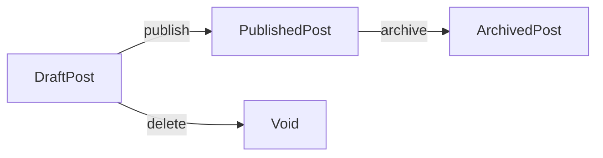

<p align=center>
  <a href="https://neuledge.com">
    <picture>
      <source media="(prefers-color-scheme: dark)" srcset="https://cdn.neuledge.com/images/logo/dark.svg">
      
    </picture>
  </a>
</p>

<p align=center>
  <strong>Universal language to model, share, and interact with databases.</strong>
</p>
<p align="center">
  <a href="https://github.com/neuledge/engine-js/actions/workflows/npm.yml" target="_blank">
    
  </a>
  <a href="https://depfu.com/github/neuledge/engine-js?project_id=37965" target="_blank">
    
  </a>
  <!-- <a href="https://www.npmjs.org/package/@neuledge/engine" target="_blank">
    
  </a> -->
  <!-- <a href="https://codecov.io/gh/neuledge/engine-js" target="_blank">
    
  </a> -->
  <a href="https://github.com/neuledge/engine-js/blob/main/LICENSE" target="_blank">
    
  </a>
  <a href="https://twitter.com/neuledge" target="_blank">
    
  </a>
  <a href="https://discord.gg/49JMwxKvhF" target="_blank">
    
  </a>
</p>
<div align="center">
  <a href="https://neuledge.com/docs" target="_blank">Documentation</a>
  <span>&nbsp;&nbsp;•&nbsp;&nbsp;</span>
  <a href="https://discord.gg/49JMwxKvhF" target="_blank">Discord</a>
  <span>&nbsp;&nbsp;•&nbsp;&nbsp;</span>
  <a href="https://www.npmjs.org/package/@neuledge/engine" target="_blank">NPM</a>
  <span>&nbsp;&nbsp;•&nbsp;&nbsp;</span>
  <a href="https://github.com/neuledge/engine-js/issues" target="_blank">Issues</a>
  <span>&nbsp;&nbsp;•&nbsp;&nbsp;</span>
  <a href="https://twitter.com/neuledge" target="_blank">@neuledge</a>
  <span>&nbsp;&nbsp;•&nbsp;&nbsp;</span>
  <a href="https://neuledge.com" target="_blank">Website</a>
</div>
<br>

## Table of contents

- [Introduction](#-introduction)
- [Features](#-features)
- [Getting started](#-getting-started)
- [Documentation & examples](#-documentation--examples)
- [Join the community](#-join-the-community)
- [License](#-license)

<br>

### ❤️ Sponsored by

If you find Neuledge useful and would like to support its ongoing development and maintenance, please consider [sponsoring us](https://github.com/sponsors/neuledge). Your sponsorship will help us to continue to improve and evolve this project. Thank you for your support!

<br>

# 👋 Introduction

[Neuledge](https://neuledge.com) is an powerfull language that simplifies data management and enhances data integrity for databases. It enables you to define your data models and business logic in a precise and customizable way. The schema language supports customizable scalar types, providing type-safe data models and ensuring that you always get the data you expect.

With Neuledge, you can create different states for the same entity, each with its own set of fields and mutations. These states are stored and accessed from the same table, with an abstraction layer that defines which fields are needed for each state. For example, you can define a "DraftPost" state with a set of fields and mutations, and then create a "PublishedPost" state that inherits from "DraftPost" and adds more fields and restrictions necessary for published posts.



The schema language is identical for relational and non-relational databases, giving you the flexibility to use it with any database of your choice. It allows you to define precise field types, validate data mutations, and enforce business rules across different states. Whether you are working with a small or complex data model, Neuledge makes it easy to manage and maintain your data.

<br>

# 🚀 Features

🌍&nbsp; **Intuitive schema** <br>
&nbsp; &nbsp; &nbsp; &nbsp; Define your data models and business logic using a simple and intuitive schema language.

📏&nbsp; **Custom types** <br>
&nbsp; &nbsp; &nbsp; &nbsp; Define custom scalar such as `Integer(min: 5, max: 10)` or `Email(at: "my-company.com")`.

🛡️&nbsp; **Percise modeling** <br>
&nbsp; &nbsp; &nbsp; &nbsp; Create different states for the same entity, each with its own set of fields and mutations.

🔄&nbsp; **Zero migrations** <br>
&nbsp; &nbsp; &nbsp; &nbsp; Avoid data migrations with automatic query rewriting per each state.

🚦&nbsp; **Explicit mutations** <br>
&nbsp; &nbsp; &nbsp; &nbsp; Define explicit mutations for each state, and allow only predefined alterations.

🔍&nbsp; **Type-safe queries** <br>
&nbsp; &nbsp; &nbsp; &nbsp; Validate your queries at compile time, with a simple and powerful query language.

🔌&nbsp; **Database agnostic** <br>
&nbsp; &nbsp; &nbsp; &nbsp; The schema language is identical for relational and non-relational databases.

<br>

## Quick comparisons

### Fetching entries from the database:

<table>
<tr>
<th>Without Neuledge</th>
<th>With Neuledge</th>
</tr>
<tr>
<td>
  
```ts
if (
  user.status === 'ACTIVE' &&
  user.email != null &&
  user.firstName != null
) {
  // handle user login..
  console.info(`Login ${user.firstName}`);
}
```
  
</td>
<td>

```ts
// skip null checks thanks to the schema state

if (user.$state === 'ActiveUser') {
  // handle user login..
  console.info(`Login ${user.firstName}`);
}
```

</td>
</tr>
</table>

### Validating data mutations:

<table>
<tr>
<th>Without Neuledge</th>
<th>With Neuledge</th>
</tr>
<tr>
<td>

```ts
// implmenet data mutations manually

await db.updateOne({
  find: {
    id: 1234,
    status: 'DRAFT',
    title: { $exists: true },
    content: { $exists: true },
  },
  set: {
    status: 'PUBLISHED',
    publishedAt: new Date(),
  },
});
```

</td>
<td>

<!-- prettier-ignore -->
```ts
// use the `publish` mutation defined 
// on the database schema

await db
  .alterUnique(DraftPost)
  .unique({ id: 1234 })
  .publish();
```

</td>
</tr>
</table>

### Handling legacy code and migrations:

<table>
<tr>
<th>Without Neuledge</th>
<th>With Neuledge</th>
</tr>
<tr>
<td>

```ts
let username;

if (user.username != null) {
  username = user.username;
} else if (user.migratedUsername != null) {
  username = user.migratedUsername;
} else {
  throw new Error('Username is missing');
}
```

</td>
<td>

```ts
// both `username` and `migratedUsername`
// are mapped to the same field by the engine
// so you can access them directly

const username = user.username;
```

</td>
</tr>
</table>

### Quering legacy code and migrations:

<table>
<tr>
<th>Without Neuledge</th>
<th>With Neuledge</th>
</tr>
<tr>
<td>

```ts
const user = await db.findOne({
  where: [
    {
      username: 'john',
    },
    {
      migratedUsername: 'john',
    },
  ],
});
```

</td>
<td>

```ts
// the engine will automatically transform
// the query to include both `username` and
// `migratedUsername` in the `where` clause

const user = await db.findUnique(...User).where({
  username: 'john',
});
```

</td>
</tr>
</table>

<br>

## Schema examples

### Unique state for each status:

<table>
<tr>
<th>RegisteredUser</th>
<th>ActiveUser</th>
</tr>

<tr>
<td>

```states
state RegisteredUser {
  id: Integer = 1
  email: Email = 2
  firstName?: String = 3
  lastName?: String = 4
  createdAt: DateTime = 5
}
```

</td>
<td>

```states
state ActiveUser from RegisteredUser {
  firstName: String = 1
  lastName: String = 2
  passwordHash: Buffer = 3
  lastLoginAt: DateTime = 4
}
```

</td>
</tr>
</table>

### Percise data mutations by state:

<table>
<tr>
<th>Register a user</th>
<th>Activate a user</th>
</tr>

<tr>
<td>

```states
register(
  email: Email,
  firstName?: String,
  lastName?: String,
): RegisteredUser => {
  createdAt: DateTime(),
}
```

</td>
<td>

```states
RegisteredUser.activate(
  passwordHash: Buffer
): ActiveUser => {
  firstName: Required(value: this.firstName),
  lastName: Required(value: this.lastName),
  lastLoginAt: DateTime(),
}
```

</td>
</tr>
</table>

### Custom data validations:

```states
state Person {
  name: String(normalize: true, trim: true, min: 3, max: 50) = 1
  email: Email(lowercase: true, trim: true, at: "gmail.com") = 2
  profilePicture?: URL(secure: true) = 3
  age: Integer(min: 18, max: 100) = 4
  createdAt: DateTime = 5
}
```

### Seemless data migrations on the fly:

<table>
<tr>
<th>Current state</th>
<th>Original state</th>
</tr>

<tr>
<td>

```states
state User from LegacyUser {
  -slug
  @unique username: String = 1
}

# runtime database migration
(LegacyUser): User => {
  username: this.slug,
}
```

</td>
<td>

```states
state LegacyUser {
  id: Integer = 1
  email: Email = 2
  slug: String = 3
  createdAt: DateTime = 4
}
```

</td>
</tr>
</table>

_(Runtime migrations are partially supported, will be fully supported in the future releases)_

<br>

# 🏁 Getting started

## ⚠️ Beta release

Neuledge is still in beta. Help us improve it by [join our community](#-join-the-community) and give us a star ⭐️. If you are interested in using Neuledge in your project, please join our [Discord server](https://discord.gg/49JMwxKvhF) and we will be happy to help you.

<br />

## Installation

Install the Neuledge engine and the MongoDB store:

```bash
npm install @neuledge/engine @neuledge/mongodb-store --save
```

Install a development dependency for the CLI:

```bash
npm install @neuledge/states-cli --save-dev
```

Add `generate:states` script on your `package.json`:

```json
{
  "scripts": {
    "generate:states": "states --output \"src/states.codegen.ts\" \"states/*.states\""
  }
}
```

On the next step, run `npm run generate:states` to generate the states code from your `*.states` files.

This will generate a `src/states.codegen.ts` file with all your business logic code.
You should add this file to your `.gitignore` file, as it will be generated automatically.

<br />

## Define your schema files

Create a `states` folder and your first `users.states` file:

```states
state CreatedUser {
  @id(auto: 'increment') id: Integer = 1
  firstName?: String = 2
  lastName?: String = 3
  @unique email: Email = 4
  @index createdAt: DateTime = 6
}

state ActiveUser from CreatedUser {
  firstName: String = 1
  lastName: String = 2
  passwordHash?: Buffer = 3
  updatedAt: DateTime = 4
}

state SuspendedUser from ActiveUser {
  suspendedAt: DateTime = 1
}

state DeletedUser from CreatedUser {
  -firstName
  -lastName
  -email

  deletedAt: DateTime = 1
}

create(
  firstName: String,
  lastName: String,
  email: Email,
): CreatedUser => {
  createdAt: DateTime(),
}

CreatedUser.activate(
  firstName: String,
  lastName: String,
  passwordHash?: Buffer,
): ActiveUser => {
  updatedAt: DateTime(),
}

create(
  firstName: String,
  lastName: String,
  email: Email,
  passwordHash?: Buffer,
): ActiveUser => {
  createdAt: DateTime(),
  updatedAt: DateTime(),
}

ActiveUser.update(
  firstName: String,
  lastName: String,
  email: Email,
  passwordHash?: Buffer,
): ActiveUser => {
  updatedAt: DateTime(),
}

ActiveUser.suspend(): SuspendedUser => {
  suspendedAt: DateTime(),
}

SuspendedUser.activate(): ActiveUser => {
  updatedAt: DateTime(),
}

either User = ActiveUser | SuspendedUser

User.delete(): DeletedUser => {
  deletedAt: DateTime(),
}

CreatedUser.delete(): Void

```

<br />

## Initialize your database

```ts
import { NeuledgeEngine } from '@neuledge/engine';
import { MongoDBStore } from '@neuledge/mongodb-store';

// import your generated code for the engine to use before initializing the engine
import `./states.codegen`;

// use the MongoDBStore to connect to your database
const store = new MongoDBStore({
  url: 'mongodb://localhost:27017',
  name: 'example',
});

// initialize the engine with the store and syncing the database schema
const engine = new NeuledgeEngine({
  store,
});
```

<br />

## Query the database

```ts
import { CreatedUser, User } from './states.codegen';

// create a new user
const createdUser = await engine
  .initOne(CreatedUser)
  .create({
    firstName: 'John',
    lastName: 'Doe',
    email: 'john.doe@example.com',
  })
  .select();

// activate the user
const activeUser = await engine
  .alterUniqueOrThrow(CreatedUser)
  .activate()
  .unique({ id: createdUser.id })
  .select();

// update the user information
const updatedUser = await engine
  .alterUniqueOrThrow(ActiveUser)
  .update({
    firstName: 'Jane',
    lastName: 'Doe',
    email: 'john.doe@example.com',
    passwordHash: Buffer.from('password'),
  })
  .unique({ id: activeUser.id })
  .select();

// suspend the user
const suspendedUser = await engine
  .alterUniqueOrThrow(ActiveUser)
  .suspend()
  .unique({ id: updatedUser.id })
  .select();

// list active and suspended users
const users = await engine.findMany(...User).limit(10);
```

<br>

# 📚 Documentation & examples

For more information, please visit [neuledge.com/docs](https://neuledge.com/docs).

For fully functional code examples, please check the [examples](https://github.com/neuledge/engine-js/tree/main/examples) folder.

<br>

# 🤝 Join the community

To get involved in the Neuledge community:

- Give us a star ⭐️ on GitHub.
- Follow us on [Twitter](https://twitter.com/neuledge).
- Join our [Discord community](https://discord.gg/49JMwxKvhF) to connect with other users and get help.
- Subscribe to our [newsletter](https://neuledge.com/#join) to stay up to date on the latest news and updates.
- If you find any bugs or have any suggestions, please [open an issue](https://github.com/neuledge/engine-js/issues/new/choose) on GitHub or let us know on our [Discord channel](https://discord.gg/49JMwxKvhF).

<br>

# 📜 License

Neuledge is [Apache 2.0 licensed](https://github.com/neuledge/engine-js/blob/main/LICENSE).
